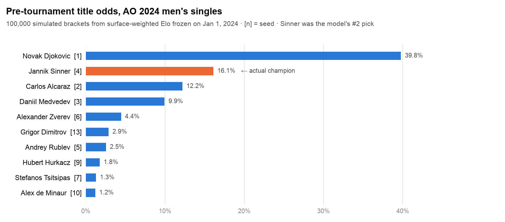
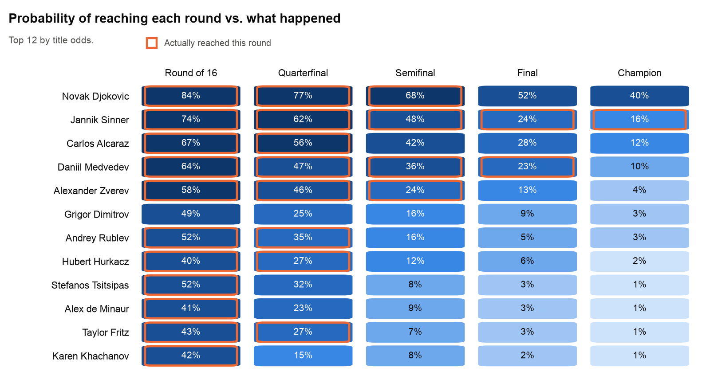
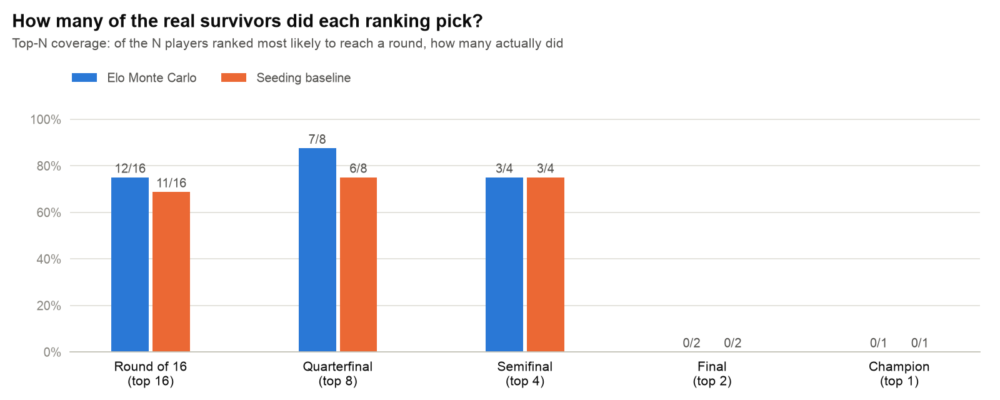
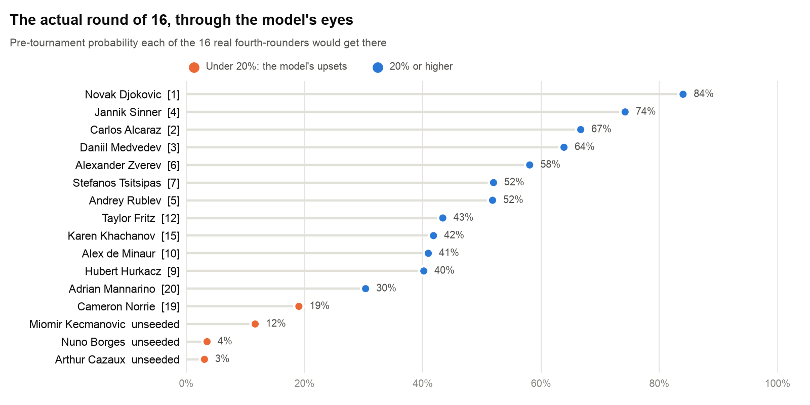

# Australian Open 2024: Monte Carlo Simulation


A surface-weighted Elo model trained on three seasons of ATP results, frozen on January 1, 2024, and used to play the real 128-player Australian Open draw **100,000 times**. The result is a probability for every player to reach every round, which is then checked against what actually happened in Melbourne.

<picture>
  <source media="(prefers-color-scheme: dark)" srcset="assets/title_odds_dark.png">
  
</picture>

## Key results

- **The champion was the model's #2 pick.** Jannik Sinner went in at **16.1%**, behind only Novak Djokovic (39.8%), and ahead of higher seeds Carlos Alcaraz [2] and Daniil Medvedev [3].
- **Elo beat the seeding committee in the early rounds.** The model's 16 most likely fourth-rounders included 12 of the real ones (seeding picked 11), and its top 8 quarterfinal picks included 7 of the 8 real quarterfinalists (seeding picked 6).
- **The surprise runs were long shots, not blind spots.** Arthur Cazaux (3%) and Nuno Borges (4%) reached the round of 16 from outside the seedings. The model rated them unlikely but not impossible, which is how a probabilistic forecast should handle upsets.
- **Knockout uncertainty compounds.** Neither the model nor seeding named either finalist in its top two. Sinner and Djokovic were drawn in the same half, so at most one of the model's two favourites could reach the final.

## Backtest against the real tournament

<picture>
  <source media="(prefers-color-scheme: dark)" srcset="assets/progression_dark.png">
  
</picture>

Outlined cells are rounds each player actually reached. The model's darkest cells line up with the real bracket through the quarterfinals. Its biggest single miss is Grigor Dimitrov (6th-best title odds, 49% to make the round of 16), who didn't make it that far. Unseeded Nuno Borges came through his section instead.

<picture>
  <source media="(prefers-color-scheme: dark)" srcset="assets/coverage_dark.png">
  
</picture>

| Round | Players | Elo model top-N hits | Seeding top-N hits |
|---|---:|---:|---:|
| Round of 16 | 16 | **12** (75%) | 11 (69%) |
| Quarterfinal | 8 | **7** (88%) | 6 (75%) |
| Semifinal | 4 | 3 (75%) | 3 (75%) |
| Final | 2 | 0 | 0 |
| Champion | 1 | 0 | 0 |

*Top-N coverage:* take the N players each method ranks most likely to reach a round and count how many actually did. The seeding baseline ranks players by seed, with unseeded players last.

<picture>
  <source media="(prefers-color-scheme: dark)" srcset="assets/r16_surprises_dark.png">
  
</picture>

## Methodology

**Elo ratings** ([Elo rating system](https://en.wikipedia.org/wiki/Elo_rating_system), adapted for tennis)
- Trained chronologically on 8,636 ATP tour-level matches (Jan 2021 – Nov 2023); every player starts at 1500
- K = 32 for best-of-five matches and 24 for best-of-three, so Grand Slam results move ratings more
- Hard-court matches count in full and clay/grass at half weight, since the Australian Open is played on hard courts
- Ratings are **frozen on January 1, 2024**: nothing from the tournament itself leaks into the forecast

**Monte Carlo bracket**
- The official 128-player draw, in real bracket order (`AO2024Draw.csv`)
- Each match is a single draw with win probability 1 / (1 + 10^((Elo_B − Elo_A)/400))
- 100,000 full tournaments (seed 42) → probability of every player reaching R64, R32, R16, QF, SF, F and winning

**Backtest**
- `AO2024Results.csv` records how far each of the 16 fourth-round players got. Every other player lost before the round of 16.

## Getting started

```bash
git clone https://github.com/LukasUNCW/Australian-Open-2024-Monte-Carlo-Simulation.git
cd Australian-Open-2024-Monte-Carlo-Simulation
pip install pandas numpy matplotlib

python fit_elo_and_simulate.py   # fit Elo, simulate 100k tournaments → results/   (~10 s)
python make_figures.py           # backtest + charts → assets/
```

| File | Contents |
|---|---|
| `fit_elo_and_simulate.py` | Elo fitting and the Monte Carlo bracket simulation |
| `make_figures.py` | Backtest against actual results; generates every chart above |
| `atp_matches_2021_2023_clean.csv` | Training data: date, surface, best-of, winner and loser IDs |
| `AO2024Draw.csv` | Official 2024 Round 1 draw, with seeds, entry status and player IDs |
| `AO2024Results.csv` | Furthest round reached by each round-of-16 player |
| `atp_players.csv` | ATP player ID → name lookup |
| `results/` | Elo snapshot and per-player advancement and title probabilities |

## Data sources

- ATP match results and player IDs: [Jeff Sackmann's `tennis_atp`](https://github.com/JeffSackmann/tennis_atp) dataset (CC BY-NC-SA 4.0)
- 2024 draw and results: transcribed from the official Australian Open draw
